<div align="center">

# 🌟 Pokemon Streaming Analytics

**Ejemplo práctico de arquitectura Producer-Consumer con tecnologías Big Data**

[](https://www.docker.com/)
[](https://kafka.apache.org/)
[](https://spark.apache.org/)
[](https://cassandra.apache.org/)
[](https://grafana.com/)

*Un pipeline completo de datos en tiempo real utilizando Pokemon como dataset para demostrar conceptos fundamentales de sistemas distribuidos*

**Desarrollado por:** [Augustin Alexandru Besu](https://github.com/augustinbesu)

</div>

---

## 🎯 Objetivo del Proyecto

Este proyecto implementa una **arquitectura de streaming distribuida** completa, demostrando:

- ✅ **Patrón Producer-Consumer** con Apache Kafka
- ✅ **Stream Processing** en tiempo real con Apache Spark
- ✅ **Almacenamiento NoSQL** escalable con Cassandra
- ✅ **Visualización en tiempo real** con Grafana
- ✅ **Análisis interactivo** con Jupyter
- ✅ **APIs RESTful** para exposición de datos
- ✅ **Containerización completa** con Docker

---

## 🏗️ Arquitectura del Sistema

```mermaid
graph TB
    subgraph "Data Source"
        A[🔗 PokeAPI]
    end
    
    subgraph "Data Ingestion"
        B[📡 Pokemon Producer<br/>Python]
    end
    
    subgraph "Message Broker"
        C[🚀 Apache Kafka<br/>Topic: pokemon-data]
    end
    
    subgraph "Stream Processing"
        D[⚡ Apache Spark<br/>Streaming]
    end
    
    subgraph "Storage Layer"
        E[🗄️ Apache Cassandra<br/>NoSQL Database]
    end
    
    subgraph "API Layer"
        F[🌐 REST API<br/>Flask]
    end
    
    subgraph "Visualization"
        G[📊 Grafana Dashboard]
        H[📈 Jupyter Analytics]
    end
    
    A --> B
    B --> C
    C --> D
    D --> E
    E --> F
    F --> G
    F --> H
    
    style A fill:#e1f5fe
    style B fill:#f3e5f5
    style C fill:#fff3e0
    style D fill:#e8f5e8
    style E fill:#fce4ec
    style F fill:#f1f8e9
    style G fill:#fff8e1
    style H fill:#e3f2fd
```



### 🔧 Componentes del Sistema

| Componente | Tecnología | Función | Puerto |
|------------|------------|---------|--------|
| **Data Producer** | Python + Requests | Obtiene datos de PokeAPI y envía a Kafka | - |
| **Message Broker** | Apache Kafka | Cola de mensajes distribuida | 29092 |
| **Stream Processor** | Apache Spark | Procesamiento en tiempo real | 8080 |
| **Database** | Apache Cassandra | Almacenamiento NoSQL escalable | 9042 |
| **REST API** | Flask | Exposición de datos | 5000 |
| **Dashboard** | Grafana | Visualización en tiempo real | 3000 |
| **Analytics** | Jupyter Lab | Análisis interactivo | 8888 |

---

## 🚀 Inicio Rápido

### 📋 Prerrequisitos

- 🐳 **Docker & Docker Compose** (v20.10+)
- 💾 **8GB RAM mínimo** disponible
- 🔌 **Puertos libres**: 3000, 5000, 8080, 8888, 9042, 29092

### ⚡ Instalación en 3 pasos

<details>
<summary>📁 <strong>1. Clonar el repositorio</strong></summary>

```bash
git clone https://github.com/augustinbesu/Producer_Consumer_Pokemon.git
cd Producer_Consumer_Pokemon
```
</details>

<details>
<summary>🔧 <strong>2. Desplegar el ecosistema completo</strong></summary>

```bash
make setup
```

**Este comando automáticamente:**
- 🏗️ Construye todas las imágenes Docker
- 🚀 Levanta todos los servicios
- ⚙️ Configura Kafka con topics
- 🗃️ Inicializa Cassandra con esquemas
- 🔄 Inicia el pipeline de datos

</details>

<details>
<summary>✅ <strong>3. Verificar el estado</strong></summary>

```bash
make status              # Estado general
make check-cassandra     # Verificar base de datos
make logs               # Ver logs en tiempo real
```
</details>

---

## 🌐 Interfaces de Usuario

<div align="center">

| 🖥️ Servicio | 🔗 URL | 🔐 Credenciales | 📝 Descripción |
|-------------|---------|-----------------|-----------------|
| **🎨 Grafana** | [localhost:3000](http://localhost:3000) | `admin` / `pokemon123` | Dashboard en tiempo real |
| **📊 Jupyter** | [localhost:8888](http://localhost:8888) | Token: `pokemon123` | Análisis de datos |
| **🔌 REST API** | [localhost:5000](http://localhost:5000) | - | API de datos |
| **⚡ Spark UI** | [localhost:8080](http://localhost:8080) | - | Monitor de Spark |

</div>

---

## 📊 Schema de Base de Datos

<details>
<summary>🗃️ <strong>Estructura de Cassandra</strong></summary>

### 📋 Tabla `raw_pokemon`
```sql
CREATE TABLE raw_pokemon (
    id int PRIMARY KEY,
    name text,
    height int,
    weight int,
    base_experience int,
    types list<text>,
    abilities list<text>,
    stats map<text, int>,
    timestamp timestamp
);
```

### 📈 Tabla `pokemon_stats`
```sql
CREATE TABLE pokemon_stats (
    stat_type text PRIMARY KEY,
    avg_value double,
    max_value int,
    min_value int,
    count_pokemon bigint,
    updated_at timestamp
);
```

### 🏷️ Tabla `pokemon_by_type`
```sql
CREATE TABLE pokemon_by_type (
    type text,
    pokemon_id int,
    pokemon_name text,
    base_experience int,
    timestamp timestamp,
    PRIMARY KEY (type, pokemon_id)
);
```

</details>

---

## 🎯 Funcionalidades Principales

### 📊 Dashboard de Grafana
- 🔢 **Contador total** de Pokemon procesados
- ⏰ **Timeline** de procesamiento por hora
- 🥧 **Distribución circular** de tipos de Pokemon
- 🏆 **Ranking** de Pokemon por experiencia

### 🔬 Jupyter Analytics
- 📈 **Visualizaciones interactivas** con Plotly
- 📊 **Análisis estadístico** por tipos
- 🔍 **Exploración de datos** en tiempo real
- 📋 **Correlaciones** entre atributos

### 🔌 API REST Endpoints

| Método | Endpoint | Descripción |
|--------|----------|-------------|
| `GET` | `/health` | Estado del servicio |
| `GET` | `/api/total-pokemon` | Total procesados |
| `GET` | `/api/type-distribution` | Distribución por tipos |
| `GET` | `/api/top-pokemon` | Top por experiencia |
| `POST` | `/query` | Endpoint para Grafana |

---

## 🛠️ Comandos de Gestión

<details>
<summary>👁️ <strong>Monitoreo</strong></summary>

```bash
make status              # Estado de servicios
make logs               # Logs en tiempo real
make logs-producer      # Logs del productor
make logs-spark         # Logs de Spark
make logs-grafana       # Logs de Grafana
```
</details>

<details>
<summary>🔍 <strong>Verificación</strong></summary>

```bash
make check-cassandra    # Datos en Cassandra
make check-kafka       # Topics de Kafka

# Consultas directas
docker exec cassandra cqlsh -e "SELECT COUNT(*) FROM pokemon_data.raw_pokemon;"
docker exec kafka kafka-console-consumer --bootstrap-server localhost:9092 --topic pokemon-data --from-beginning
```
</details>

<details>
<summary>🔄 <strong>Gestión de Servicios</strong></summary>

```bash
make restart-producer   # Reiniciar productor
make restart-spark      # Reiniciar Spark
make restart-grafana    # Reiniciar Grafana
make clean             # Limpiar todo
make setup             # Reconstruir completo
```
</details>

---

## 📈 Pipeline de Datos

### 1️⃣ **Ingesta** 
- **Fuente**: [PokeAPI](https://pokeapi.co/)
- **Frecuencia**: 3-8 segundos (aleatorio)
- **Formato**: JSON estructurado
- **Volumen**: ~100-200 Pokemon/hora

### 2️⃣ **Streaming**
- **Broker**: Apache Kafka
- **Topic**: `pokemon-data`
- **Particiones**: 3
- **Retención**: 24 horas

### 3️⃣ **Procesamiento**
- **Engine**: Apache Spark Streaming
- **Trigger**: Cada 10-20 segundos
- **Operaciones**: Parseo, limpieza, agregaciones

### 4️⃣ **Almacenamiento**
- **BD**: Apache Cassandra
- **Estrategia**: SimpleStrategy
- **Replicación**: Factor 1

---

## 🧰 Stack Tecnológico

<div align="center">

| Categoría | Tecnología | Versión | Propósito |
|-----------|------------|---------|-----------|
| **🐳 Contenedores** | Docker Compose | 3.8 | Orquestación |
| **📨 Streaming** | Apache Kafka | 2.8 | Message Broker |
| **⚡ Procesamiento** | Apache Spark | 3.3 | Stream Processing |
| **🗄️ Base de Datos** | Apache Cassandra | 4.0 | NoSQL Storage |
| **🌐 API** | Flask | 2.3 | REST Services |
| **📊 Visualización** | Grafana | 9.0 | Dashboards |
| **🔬 Analytics** | Jupyter Lab | 3.6 | Data Science |
| **🐍 Lenguaje** | Python | 3.9 | Backend |

</div>

---

## 🚨 Troubleshooting

<details>
<summary>⚠️ <strong>Problemas Comunes</strong></summary>

### 🔴 Servicios no inician
```bash
docker compose logs <servicio>
docker system df  # Verificar espacio
```

### 🟡 Cassandra no responde
```bash
# Esperar 1-2 minutos para inicialización
docker exec cassandra nodetool status
```

### 🟠 Spark desconectado
```bash
docker exec spark-processor ping cassandra
make restart-spark
```

### 🔵 Grafana sin datos
```bash
curl http://localhost:5000/api/total-pokemon
# Verificar datasource en Grafana UI
```

</details>

<details>
<summary>📋 <strong>Logs de Verificación</strong></summary>

**✅ Productor funcionando:**
```
INFO - Obtenido Pokemon: charizard (id: 6)
INFO - Enviado a Kafka: pokemon-data
```

**✅ Spark procesando:**
```
INFO - Batch 5: Escribiendo 3 registros a Cassandra
INFO - Batch 5: 3 registros escritos a raw_pokemon
```

**✅ API funcionando:**
```
INFO - Conectado a Cassandra
INFO - get_type_distribution devolvió 5 tipos
```

</details>

---

## 📊 Métricas de Rendimiento

<div align="center">

| Métrica | Valor Típico | Descripción |
|---------|--------------|-------------|
| **⚡ Latencia de ingesta** | < 100ms | Tiempo desde API hasta Kafka |
| **🚀 Throughput Kafka** | 100-1K msg/seg | Capacidad de mensajes |
| **⏱️ Latencia Spark** | 10-30 segundos | Procesamiento por batch |
| **🔌 API Response** | < 200ms | Tiempo de respuesta |
| **📊 Actualización Grafana** | 5 segundos | Frecuencia de refresh |

</div>

---

## 🔮 Posibles Extensiones

- 🔗 **Kafka Connect** para conectores automáticos
- 🌊 **Apache Airflow** para orquestación de workflows  
- ⚡ **Redis** para caché de consultas frecuentes
- 🔍 **Elasticsearch** para búsquedas textuales
- 🤖 **Machine Learning** para predicciones de Pokemon
- 🔒 **Security** con autenticación y autorización
- 🌍 **Kubernetes** para despliegue en producción

---

<div align="center">

## 🎓 Fines Educativos

> Este proyecto está diseñado para **demostrar conceptos de Big Data** y **sistemas distribuidos**. 
> Para entornos de producción, considerar configuraciones adicionales de **seguridad**, **monitoreo** y **escalabilidad**.

</div>
